# Capstone 3: Easy Shop

### Description:
This Capstone is an online shop that users can utilize for their shopping needs. Some of the things
the users can do is add proudcts to their cart, update their profile, log in and out, cart saves to user after log out and upon login, users will see their
cart items. Part of this capstone was creating the DAOs, and end points, configuring them together to achieve successful requests.
     
##
##
# Home Screen
####
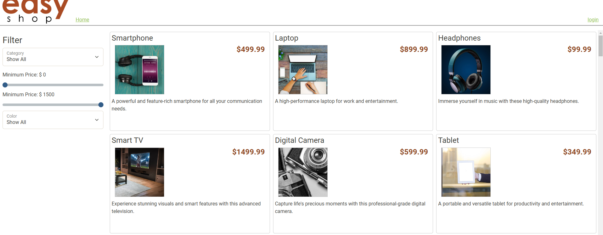
####
Upon launching the project this is the first thing you see. I'll walk you through the application and its features.
#
# Admin Login
####
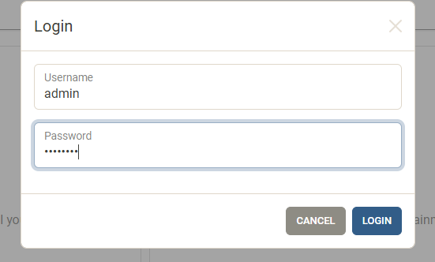
####
Here we have the admin logging in
#
# Admin Logged in
####
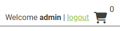
####
Admin with cart of zero
#
# Adding Items to Cart
####
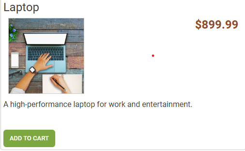
####

# Cart Items
####
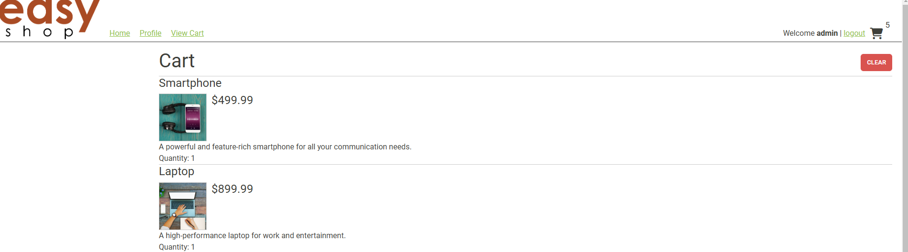
####
The cart is updated and displayed

# Clearing the Cart
####
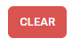
####

# User Logged in
####
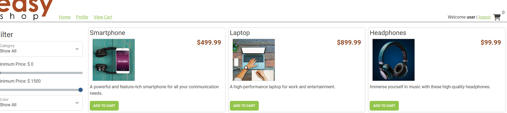
####
Now that we are logged in with our user, can update their profile

# User Profile
####
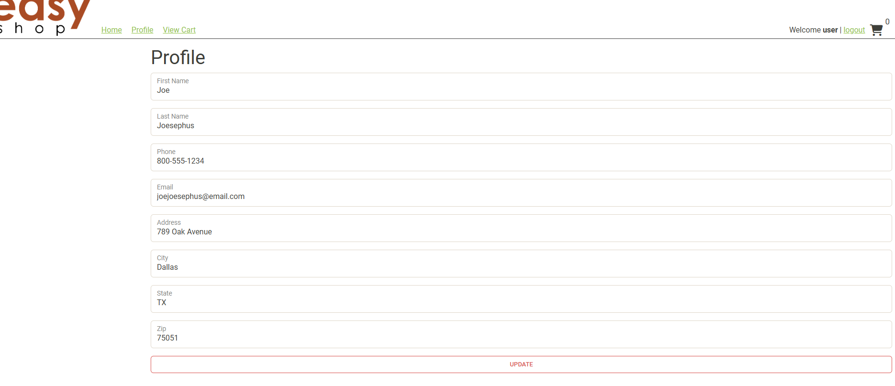
####
Next we will update the users last name 

# Updated Profile
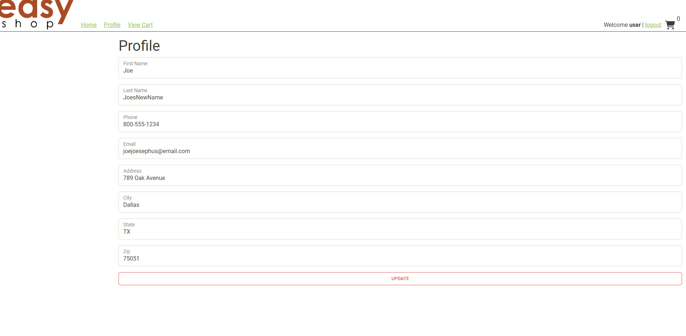
####

# Categories selection
####
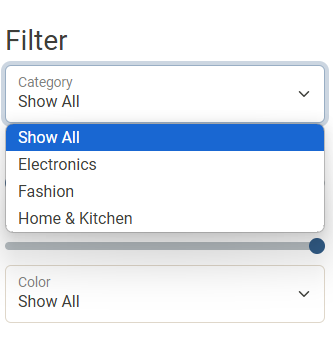
####
Category, minimum price, maximum price, color filters

# Postman Tests
####
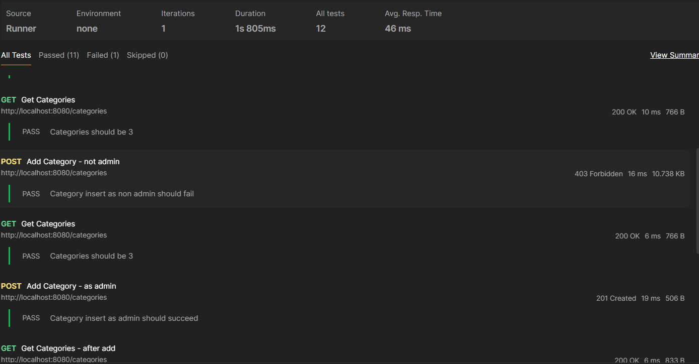
#### 
Phase 1 and 2

# Interesting Piece of Code
####
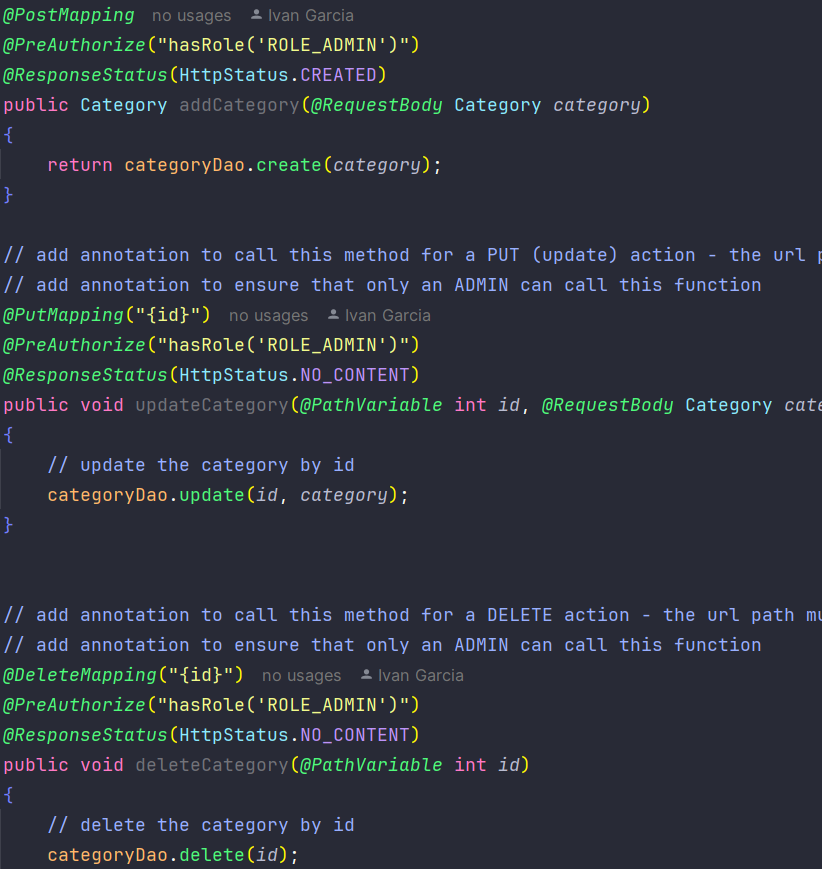
####
I chose this code as the most interesting because it is amazing to me how all of these methods and classes are connected together to 
transfer data over the internet. 

